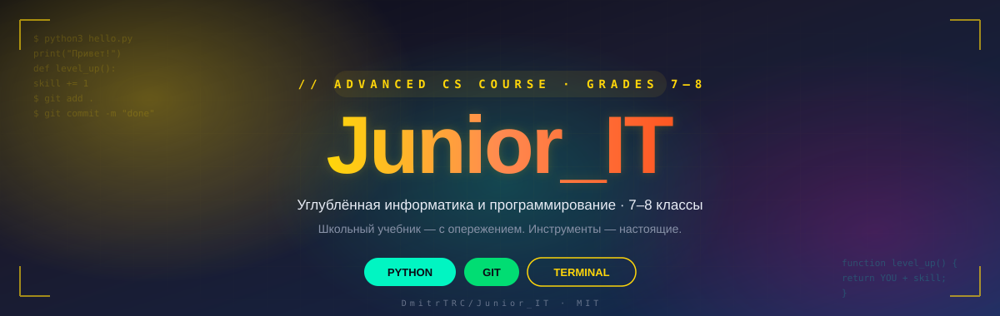
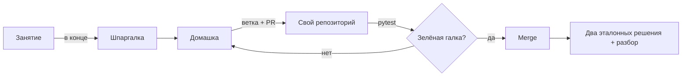

<div align="center">

<a href="https://dmitrtrc.github.io/Junior_IT/">
  
</a>

<br><br>

[](https://github.com/DmitrTRC/Junior_IT/actions/workflows/deploy.yml)
[](LICENSE)

[](#-для-разработчиков)
[](#-для-разработчиков)

</div>

---

## 🎯 Суть

**Junior_IT** — индивидуальный курс углублённой информатики и программирования
для 7–8 классов. Опора курса — школьный учебник информатики (Босова), но ход —
с опережением программы. Основной язык — Python. Инструменты — настоящие, те
же, что у взрослых разработчиков: терминал, git, автоматическая проверка
домашних заданий тестами.

## 🗓️ Как устроено занятие

- Формат — один на один, через Zoom: за клавиатурой сидит ученик и делится
  экраном, а не смотрит, как код пишет преподаватель.
- Два занятия в неделю — среда и воскресенье.
- 75 минут — потолок одного занятия.
- Теория — блоками не дольше двух минут, дальше снова руки на клавиатуре.

## 🔁 Как работает ученик



Git включается со второго занятия, автоматическая проверка домашек — с конца
сентября; до этого домашки сдаются в мессенджер.

## 🧭 Треки курса

| Чип | Трек | Что внутри | Статус |
|---|---|---|---|
| `BOOK` | Учебник | теория по Босовой, 7–8 класс, с опережением программы | идёт |
| `PY` | Python | основной язык курса | идёт |
| `PAS` | Pascal | второй диалект: та же задача, другой синтаксис — главы 4 и 5 учебника 8 класса зеркальны | впереди |
| `OPS` | DevOps | терминал, git, автоматическая проверка домашних заданий по зелёной галке CI | идёт |
| `CS` | Компьютер изнутри | как это всё устроено под капотом | идёт |
| `WEB` | Web (архив) | архив первого сезона, выдаётся по запросу | архив |

Живая карта модулей и статусов —
[dmitrtrc.github.io/Junior_IT/#hub](https://dmitrtrc.github.io/Junior_IT/#hub).

## 🗂️ Структура репозитория

```
tracks/         библиотека модулей — shared/ (на экране), student/ (ученику), teacher/ (преподавателю)
playground/     журналы занятий
textbook/       атлас соответствия учебнику и поправки к нему
homework/       условия домашних заданий
trainer/        тренажёр — в работе
tools/          валидатор, генератор карты курса, сборка сайта
meta/           методика и канон модуля
docs/           гайды
lessons/        редиректы со старых адресов уроков
provisioning/   настройка учебного компьютера
```

Анатомия модуля — файлы, роли и конвенции — описана в
[`meta/module-anatomy.md`](meta/module-anatomy.md).

## 👀 Кто что видит

| Слой | Кто видит | Что там |
|---|---|---|
| Сайт (GitHub Pages) | все | лендинг, слайды, демки, шпаргалки, тренажёр (скоро) |
| Публичный GitHub | любой, кто откроет репозиторий | + сценарии преподавателя, домашки, журналы занятий, инструменты |
| Машина преподавателя | только преподаватель | учебники PDF, записи занятий, работы ученика, переписка с родителями, граф знаний |

Методика открыта сознательно — сценарии занятий можно читать, это часть
качества курса; эталонные решения домашних заданий в открытый репозиторий не
попадают — ученик получает их после сдачи.

Персональное — записи занятий, работы ученика, переписка — не покидает
компьютера преподавателя.

## ❓ Вопросы

<details>
<summary>Сколько времени нужно вне занятий?</summary>
<br>
Домашка занимает 30–60 минут между занятиями.
</details>

<details>
<summary>Какой компьютер нужен?</summary>
<br>
Подойдёт любой не старше ~10 лет. Курс идёт на macOS, Windows — с оговорками,
которые проговариваются на занятии. Подробный гайд под каждую платформу —
<a href="https://dmitrtrc.github.io/Junior_IT/docs/setup-guide.html">настройка учебного компьютера</a>.
</details>

<details>
<summary>Что ребёнок будет уметь через полгода?</summary>
<br>
Уверенный терминал и git, материал 8 класса по Python при собственном 7-м,
привычку к автоматической проверке кода и разбору решения. Подробнее о том,
что стоит за этим списком помимо кода — на отдельной странице:
<a href="https://dmitrtrc.github.io/Junior_IT/docs/soft-vs-hard-skills.html">софт- и хард-скилы</a>.
</details>

<details>
<summary>Как проверяются домашки?</summary>
<br>
Первые домашки сдаются обычным сообщением в мессенджер — преподаватель
проверяет и отвечает лично. Дальше включается автоматика: тесты запускаются
при отправке, зелёная галка — домашка сдана, преподаватель смотрит только
качество решения.
</details>

<details>
<summary>Что видно публично и безопасно ли это?</summary>
<br>
См. таблицу «Кто что видит» выше. Имя ребёнка, лицо, записи занятий — не
публикуются.
</details>

<details>
<summary>Мы не программисты — сможем ли помогать?</summary>
<br>
Помощь не нужна: материалы самодостаточны, преподаватель на связи. Лучший
вклад со стороны семьи — время и место для занятий.
</details>

## 🛠 Для разработчиков

```bash
cd tools
.venv/bin/python -m pytest              # 60 тестов
.venv/bin/python validate_modules.py .. # схема и целостность модулей
./build_site.sh                         # сборка публикуемой части в _site/
```

Плюс команда `/new-module` в Claude CLI — разворачивает новый модуль по
канону из [`meta/module-anatomy.md`](meta/module-anatomy.md).

PR извне не ожидаются — курс ведётся один на один и меняется под конкретного
ученика, но методику и инструменты можно свободно переиспользовать:
лицензия [MIT](LICENSE).

---

<div align="center">

Ведёт Дмитрий Морозов — senior-разработчик, 30+ лет в индустрии ·
[GitHub](https://github.com/DmitrTRC) · [MIT](LICENSE)

</div>
